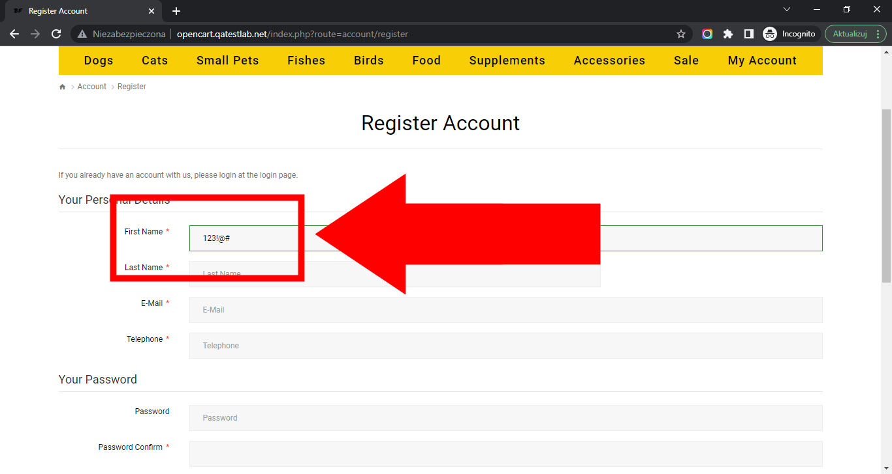

# Best Friends

## Issue #0936631

**Summary**: 0936631: The 'First Name' field is not validated on the 'Register Account' page after inputting invalid characters

- **Priority**: normal
- **Severity**: minor
- **Reproducibility**: always
- **Platform**: Google Chrome 112.0.5615.50
- **OS**: Windows
- **OS Version**: 10 x64

**Description:** The 'First Name' field is not validated on the 'Register Account' page after inputting invalid characters.

**Steps To Reproduce:**

1. Open page http://opencart.qatestlab.net/
2. Click the 'Sign In' link in the top page menu.
3. Click the 'Continue' button in the 'New Customer' section.
4. Locate the 'First Name' input field.
5. Type '123!@#' into the 'First Name' input field.
6. Pay attention to the 'First Name' input field highlight.

**Actual result:** The 'First Name' field is not validated on the 'Register Account' page after inputting invalid characters.

**Expected result:** The 'Only letters and hyphens are allowed' message is shown below the 'First Name' input field on the 'Register Account' page after inputting invalid characters.

**Screenshot:**

**Additional Information:** The same issue occurs on:

- Mozilla Firefox 111.0.1
- Microsoft Edge 112.0.1722.34
