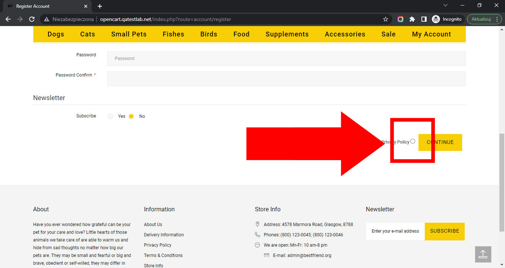

# Best Friends

## Issue #0936632

**Summary**: 0936632: Invalid form button (radio) is used for the 'Privacy Policy' option on the 'Register Account' page

- **Priority**: normal
- **Severity**: minor
- **Reproducibility**: always
- **Platform**: Google Chrome 112.0.5615.50
- **OS**: Windows
- **OS Version**: 10 x64

**Description:** Invalid form button (radio) is used for the 'Privacy Policy' option on the 'Register Account' page.

**Steps To Reproduce:**

1. Open page http://opencart.qatestlab.net/
2. Click the 'Sign In' link in the top page menu.
3. Click the 'Continue' button in the 'New Customer' section.
4. Locate the 'Privacy Policy' option at the end of the 'Register Account' form.
5. Pay attention to the button type of the 'Privacy Policy' option.

**Actual result:** Invalid form button (radio) is used for the 'Privacy Policy' option on the 'Register Account' page.

**Expected result:** Valid form button (checkbox) is used for the 'Privacy Policy' option on the 'Register Account' page.

**Screenshot:**

**Additional Information:** The same issue occurs on:

- Mozilla Firefox 111.0.1
- Microsoft Edge 112.0.1722.34
