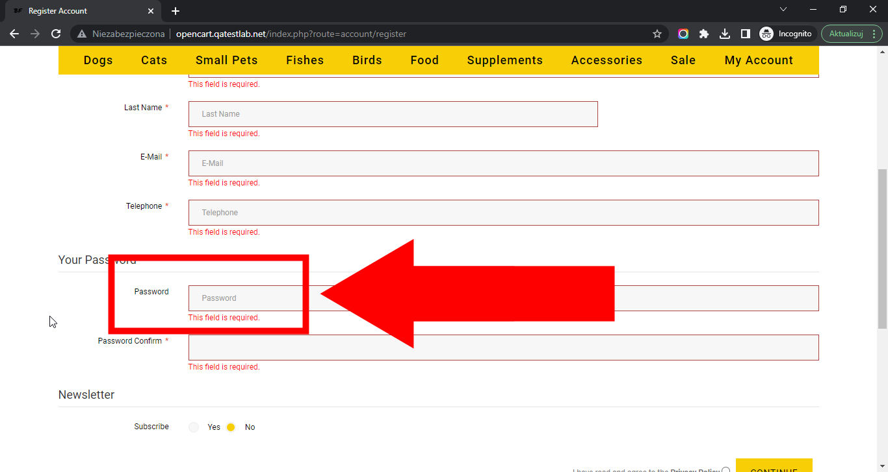

# Best Friends

## Issue #0936634

**Summary**: 0936634: The 'Password' field is not marked as required on the 'Register Account' page

- **Priority**: normal
- **Severity**: minor
- **Reproducibility**: always
- **Platform**: Google Chrome 112.0.5615.50
- **OS**: Windows
- **OS Version**: 10 x64

**Description:** The 'Password' field is not marked as required on the 'Register Account' page.

**Steps To Reproduce:**

1. Open page http://opencart.qatestlab.net/
2. Click the 'Sign In' link in the top page menu.
3. Click the 'Continue' button in the 'New Customer' section.
4. Click the 'Continue' button at the end of the 'Register Account' form.
5. Locate the 'Password' field in the 'Register Account' form.
6. Note the lack of an asterisk on the 'Password' field name.
7. Pay attention to the error below the 'Password' field.

**Actual result:** The 'Password' field is not marked as required on the 'Register Account' page.

**Expected result:** The 'Password' field is marked as required on the 'Register Account' page.

**Screenshot:**

**Additional Information:** The same issue occurs on:

- Mozilla Firefox 111.0.1
- Microsoft Edge 112.0.1722.34
