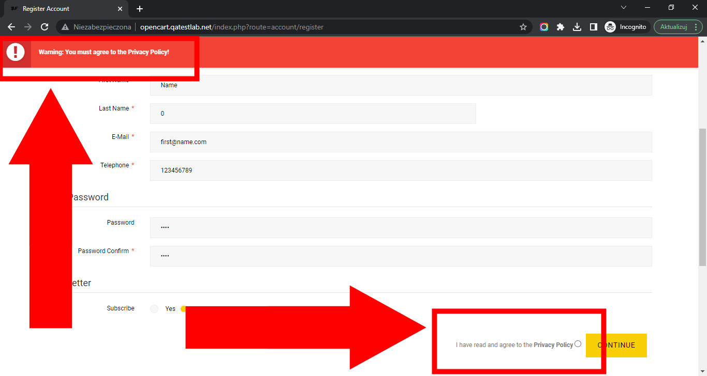

# Best Friends

## Issue #0936635

**Summary**: 0936635: The 'Privacy Policy' button is not marked as required on the 'Register Account' page

- **Priority**: normal
- **Severity**: minor
- **Reproducibility**: always
- **Platform**: Google Chrome 112.0.5615.50
- **OS**: Windows
- **OS Version**: 10 x64

**Description:** The 'Privacy Policy' button is not marked as required on the 'Register Account' page.

**Steps To Reproduce:**

1. Open page http://opencart.qatestlab.net/
2. Click the 'Sign In' link in the top page menu.
3. Click the 'Continue' button in the 'New Customer' section.
4. Type 'Name' in the 'First Name' input field.
5. Type '0' in the 'Last Name' input field.
6. Type 'first@name.com' in the 'E-Mail' input field.
7. Type '123456789' in the 'Telephone' input field.
8. Type '1234' in the 'Password' input field.
9. Type '1234' in the 'Password Confirm' input field.
10. Note the lack of an asterisk on the 'Privacy Policy' button.
11. Click the 'Continue' button at the end of the 'Register Account' form.
12. Pay attention to the error message at the top of the page.

**Actual result:** The 'Privacy Policy' button is not marked as required on the 'Register Account' page.

**Expected result:** The 'Privacy Policy' button is marked as required on the 'Register Account' page.

**Screenshot:**

**Additional Information:** The same issue occurs on:

- Mozilla Firefox 111.0.1
- Microsoft Edge 112.0.1722.34
