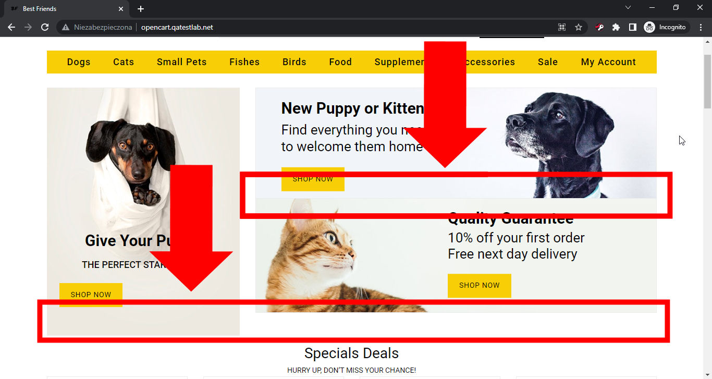

# Best Friends
## Issue #0934419

**Summary**: 0934419: The top right banners are placed without a gap on the main page

- **Priority**: normal
- **Severity**: minor
- **Reproducibility**: always
- **Platform**: Google Chrome 112.0.5615.50
- **OS**: Windows
- **OS Version**: 10 x64

**Description:** Two top-right banners are placed without a gap on the main page below the top menu. Without this gap, the left and right banner columns are not aligned at the bottom.

**Steps To Reproduce:**
1. Open page http://opencart.qatestlab.net/
2. Locate three banners below the top menu with the shop categories.
3. Pay attention to the spacing of two banners in the right column.

**Actual result:** Two top-right banners are placed without a gap on the main page below the top menu.

**Expected result:** Two top-right banners are placed with a gap on the main page below the top menu.

**Screenshot:**

**Additional Information:** The same issue occurs on:
- Mozilla Firefox 111.0.1
- Microsoft Edge 112.0.1722.34
