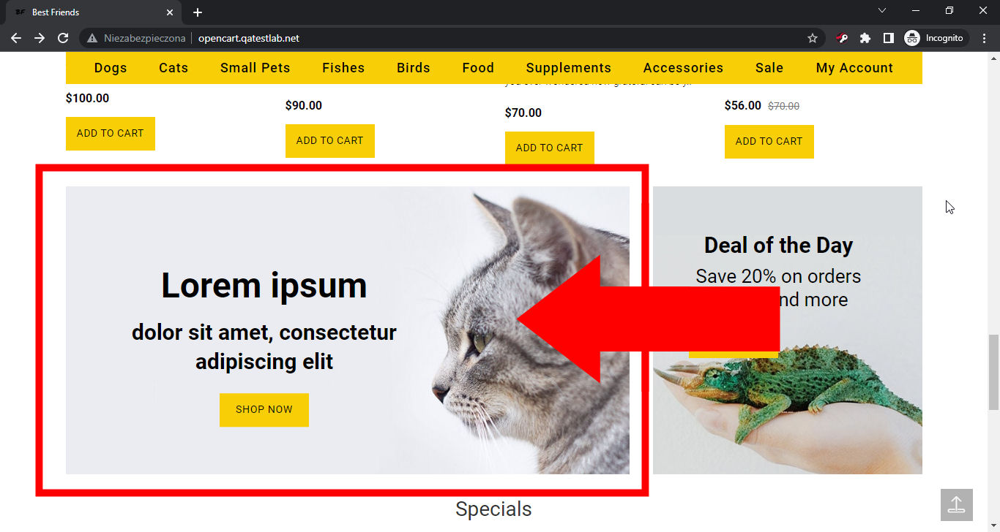

# Best Friends

## Issue #0934441

**Summary**: 0934441: A banner with the 'Lorem ipsum' text is shown on the main page

- **Priority**: high
- **Severity**: text
- **Reproducibility**: always
- **Platform**: Google Chrome 112.0.5615.50
- **OS**: Windows
- **OS Version**: 10 x64

**Description:** A banner with the 'Lorem ipsum' template text is shown on the main page above the 'Specials' section.

**Steps To Reproduce:**

1. Open page http://opencart.qatestlab.net/
2. Locate the 'Specials' section header on the page.
3. Pay attention to the banner above the 'Specials' section.

**Actual result:** A banner with the 'Lorem ipsum' template text is shown on the main page above the 'Specials' section.

**Expected result:** A banner with correct text (without the 'Lorem ipsum' template) is shown on the main page above the 'Specials' section.

**Screenshot:**

**Additional Information:** The same issue occurs on:

- Mozilla Firefox 111.0.1
- Microsoft Edge 112.0.1722.34
