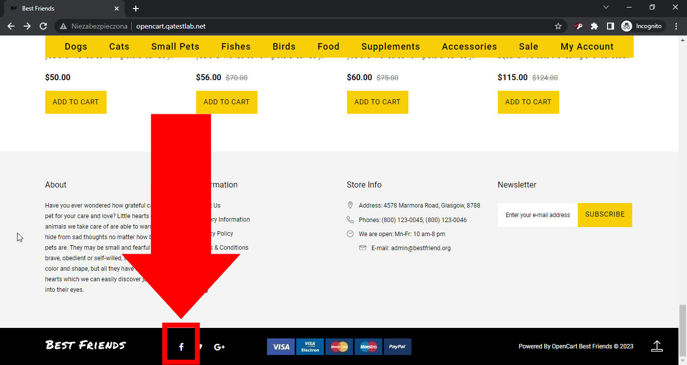

# Best Friends

## Issue #0934451

**Summary**: 0934451: An incorrect Facebook link is used on the social media button in the footer

- **Priority**: high
- **Severity**: tweak
- **Reproducibility**: always
- **Platform**: Google Chrome 112.0.5615.50
- **OS**: Windows
- **OS Version**: 10 x64

**Description:** The link to the incorrect Facebook page is used on the Facebook social media button in the footer. The link goes to the 'QATestLab' page instead of the 'Best Friends' page.

**Steps To Reproduce:**

1. Open page http://opencart.qatestlab.net/
2. Scroll to the bottom of the main page.
3. Click the Facebook icon on the footer.
4. Pay attention to the name and content of opened Facebook page.

**Actual result:** The link to the incorrect Facebook page ('QATestLab') is used on the Facebook social media button in the footer.

**Expected result:** The link to the correct Facebook 'Best Friends' page is used on the Facebook social media button in the footer.

**Screenshot:**

**Video:**

[0934451.webm](https://user-images.githubusercontent.com/1151664/233936313-9b37bff7-e13b-4985-9645-2879c91b64e8.webm)

**Additional Information:** The same issue occurs on:

- Mozilla Firefox 111.0.1
- Microsoft Edge 112.0.1722.34
