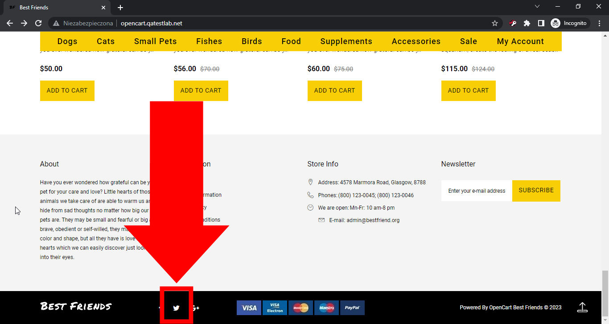

# Best Friends
## Issue #0934456

**Summary**: 0934456: An incorrect Twitter link is used on the social media button in the footer

- **Priority**: high
- **Severity**: tweak
- **Reproducibility**: always
- **Platform**: Google Chrome 112.0.5615.50
- **OS**: Windows
- **OS Version**: 10 x64

**Description:** The link to the incorrect Twitter page is used on the Twitter social media button in the footer. The link goes to 'https://twitter.com/404' instead of the 'Best Friends' account.

**Steps To Reproduce:**
1. Open page http://opencart.qatestlab.net/
2. Scroll to the bottom of the main page.
3. Click the Twitter icon on the footer.
4. Pay attention to the webpage address of opened Twitter page.

**Actual result:** The link to the incorrect Twitter page ('https://twitter.com/404') is used on the Twitter social media button in the footer.

**Expected result:** The link to the correct Twitter 'Best Friends' account is used on the Twitter social media button in the footer.

**Screenshot:**

**Video:**

[0934456.webm](0934456.webm)

**Additional Information:** The same issue occurs on:
- Mozilla Firefox 111.0.1
- Microsoft Edge 112.0.1722.34
