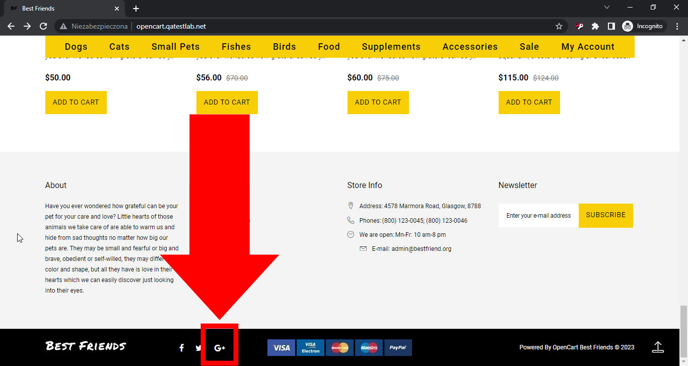

# Best Friends
## Issue #0934460

**Summary**: 0934460: Google+ (dead portal) link is used as the social media button in the footer

- **Priority**: high
- **Severity**: tweak
- **Reproducibility**: always
- **Platform**: Google Chrome 112.0.5615.50
- **OS**: Windows
- **OS Version**: 10 x64

**Description:** Google+ link is used as the social media button in the footer. It's a dead link because Google+ was shut down for business and personal use on April 2, 2019.

**Steps To Reproduce:**
1. Open page http://opencart.qatestlab.net/
2. Scroll to the bottom of the main page.
3. Pay attention to the Google+ icon on the footer.

**Actual result:** Google+ link is used as the social media button in the footer.

**Expected result:** No Google+ link is used as the social media button in the footer.

**Screenshot:**

**Additional Information:** The same issue occurs on:
- Mozilla Firefox 111.0.1
- Microsoft Edge 112.0.1722.34
