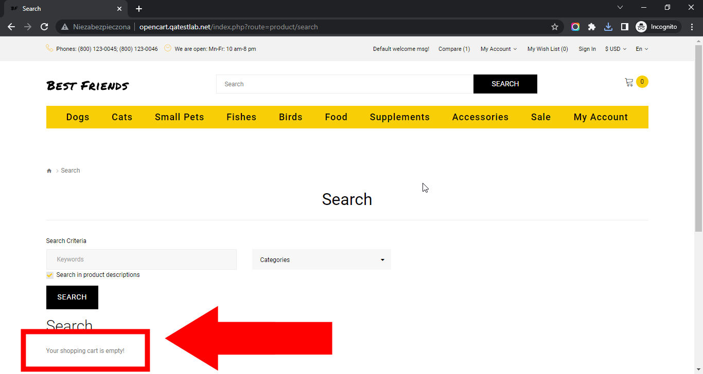

# Best Friends

## Issue #0935499

**Summary**: 0935499: An incorrect search message is shown on the search page after an empty search

- **Priority**: low
- **Severity**: minor
- **Reproducibility**: always
- **Platform**: Google Chrome 112.0.5615.50
- **OS**: Windows
- **OS Version**: 10 x64

**Description:** An incorrect search message ('Your shopping cart is empty!') is shown on the search page after an empty search.

**Steps To Reproduce:**

1. Open page http://opencart.qatestlab.net/
2. Locate the 'Search" button at the top of the page.
3. Click the 'Search' button.
4. Pay attention to the message above the footer.

**Actual result:** An incorrect search message ('Your shopping cart is empty!') is shown on the search page after an empty search.

**Expected result:** The correct search message ('No search results!') is shown on the search page after an empty search.

**Screenshot:**

**Video:**

**Additional Information:** The same issue occurs on:

- Mozilla Firefox 111.0.1
- Microsoft Edge 112.0.1722.34
