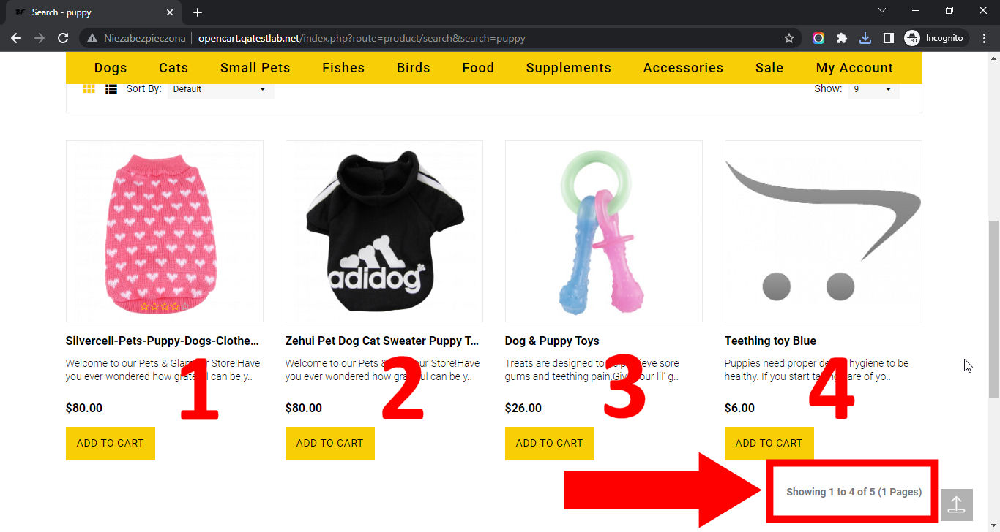

# Best Friends

## Issue #0935500

**Summary**: 0935500: An incorrect number of products is shown on the search page after searching for products

- **Priority**: low
- **Severity**: minor
- **Reproducibility**: always
- **Platform**: Google Chrome 112.0.5615.50
- **OS**: Windows
- **OS Version**: 10 x64

**Description:** An incorrect number of products (+1 more) is shown at the bottom of the search page after searching for products.

**Steps To Reproduce:**

1. Open page http://opencart.qatestlab.net/
2. Locate the search input field at the top of the page.
3. Type 'puppy' in the search field.
4. Click the 'Search' button.
5. Pay attention to the message about a number of products below searched products on the right side.

**Actual result:** An incorrect number of products (+1 more) is shown at the bottom of the search page after searching for products.

**Expected result:** The correct number of products is shown at the bottom of the search page after searching for products.

**Screenshot:**

**Video:**

**Additional Information:** The same issue occurs on:

- Mozilla Firefox 111.0.1
- Microsoft Edge 112.0.1722.34
