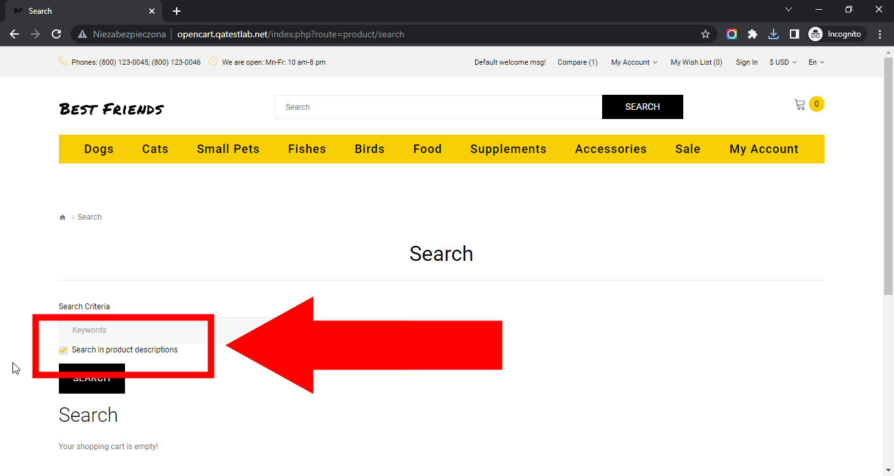

# Best Friends
## Issue #0935501

**Summary**: 0935501: The 'Search in product descriptions' option is checked on the search page after searching

- **Priority**: normal
- **Severity**: minor
- **Reproducibility**: always
- **Platform**: Google Chrome 112.0.5615.50
- **OS**: Windows
- **OS Version**: 10 x64

**Description:** The 'Search in product descriptions' option is checked by default on the search page after searching.

**Steps To Reproduce:**
1. Open page http://opencart.qatestlab.net/
2. Locate the 'Search" button at the top of the page.
3. Click the 'Search' button.
4. Pay attention to the 'Search in product descriptions' option below the 'Keywords' input field.

**Actual result:** The 'Search in product descriptions' option is checked by default on the search page after searching.

**Expected result:** The 'Search in product descriptions' option is unchecked by default on the search page after searching.

**Screenshot:**

**Video:**

**Additional Information:** The same issue occurs on:
- Mozilla Firefox 111.0.1
- Microsoft Edge 112.0.1722.34
