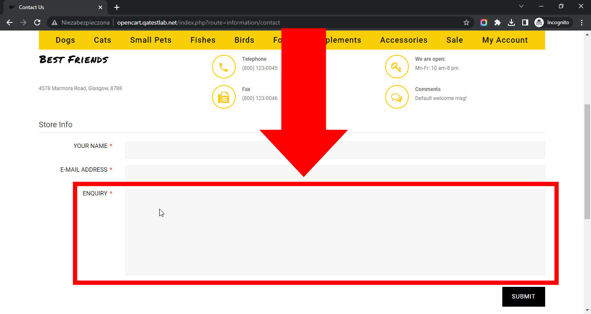

# Best Friends

## Issue #0935849

**Summary**: 0935849: The 'ENQUIRY' form field is not activated on the 'Contact Us' page after clicking on it

- **Priority**: normal
- **Severity**: major
- **Reproducibility**: always
- **Platform**: Google Chrome 112.0.5615.50
- **OS**: Windows
- **OS Version**: 10 x64

**Description:** The 'ENQUIRY' form field is not activated on the 'Contact Us' page after clicking on it.

**Steps To Reproduce:**

1. Open page http://opencart.qatestlab.net/
2. Scroll to the bottom of the page.
3. Locate the 'Information' section in the footer.
4. Click on the 'Store Info' link.
5. Scroll down to the 'Store Info' form.
6. Click on the 'ENQUIRY' form field.
7. Pay attention to the 'ENQUIRY' form field.

**Actual result:** The 'ENQUIRY' form field is not activated on the 'Contact Us' page after clicking on it.

**Expected result:** The 'ENQUIRY' form field is activated on the 'Contact Us' page after clicking on it.

**Screenshot:**

**Additional Information:** The same issue occurs on:

- Mozilla Firefox 111.0.1
- Microsoft Edge 112.0.1722.34
