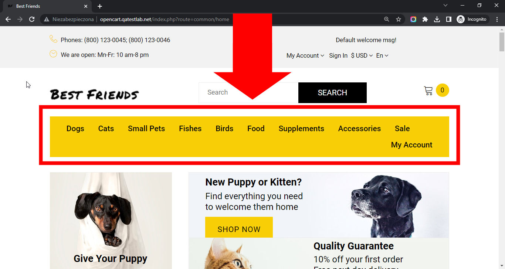

# Best Friends

## Issue #0936000

**Summary**: 0936000: The top main menu is stretched on the page after zooming to 150%

- **Priority**: high
- **Severity**: minor
- **Reproducibility**: always
- **Platform**: Google Chrome 112.0.5615.50
- **OS**: Windows
- **OS Version**: 10 x64

**Description:** The top main menu is stretched on the page after zooming to 150%.

**Steps To Reproduce:**

1. Open page http://opencart.qatestlab.net/
2. Zoom page to 150%.
3. Locate the top menu with shop categories.
4. Pay attention to its size.

**Actual result:** The top main menu is stretched on the page after zooming to 150%.

**Expected result:** The top main menu is not stretched on the page after zooming to 150%.

**Screenshot:**

**Additional Information:** The same issue occurs on:

- Mozilla Firefox 111.0.1
- Microsoft Edge 112.0.1722.34
