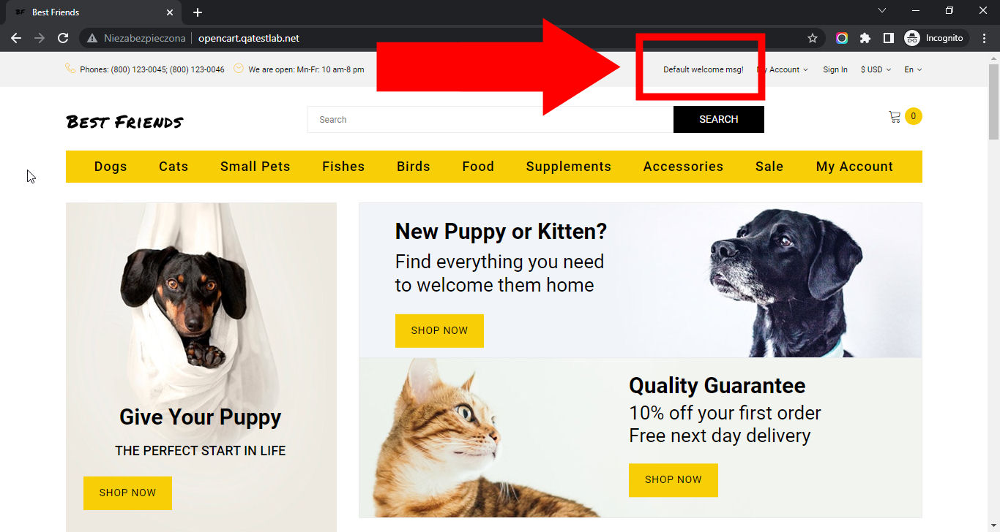

# Best Friends

## Issue #MAR-1

**Description:** Incorrect 'Default welcome msg!' information is shown on the top navigation after opening the main page

**Steps To Reproduce:**

1. Open page http://opencart.qatestlab.net/
2. Locate the top navigation at the top of the page.
3. Pay attention to the right side of the top navigation.

**Actual result:** Incorrect 'Default welcome msg!' information is shown on the top navigation after opening the main page.

**Expected result:** Correct default information is shown on the top navigation after opening the main page.

**Environment**: Google Chrome 112.0.5615.50, Windows 10 x64

**Screenshot:**

**Additional Information:** The same issue occurs on:

- Mozilla Firefox 111.0.1
- Microsoft Edge 112.0.1722.34
