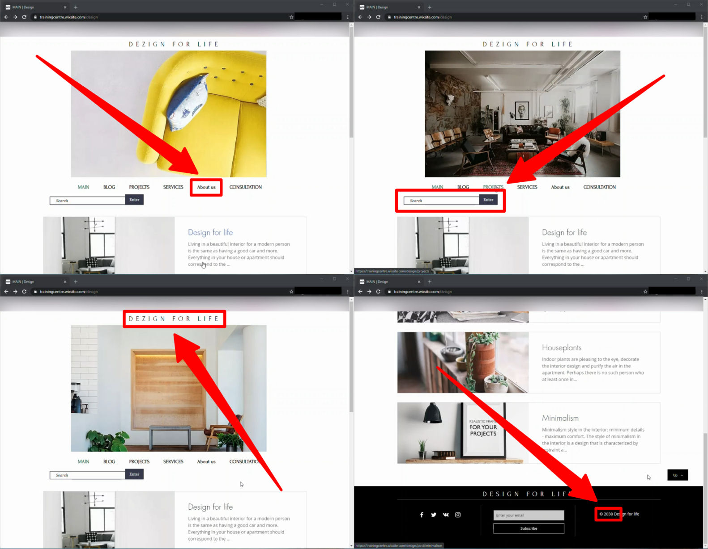

# Design for Life

## About the job

- **Source:** A design blog created for testing purposes (Video file)
- **Task:** Describe 1-3 bugs in the Mantis Bug Tracker
- **Environment:** Google Chrome 87.0.4280.88 in Windows 10 x64 (specified in task description)
- **Additional information:** Part of the Homework (Reporting Bugs) for the [QATestLab Training Center](https://en.training.qatestlab.com/) course [Fundamentals of Software Testing](https://en.training.qatestlab.com/course/software-testing-fundamentals/)

## Issues

#### [Issue #0933301: The image is missed on the carousel on the 'Design' page](/Design_for_Life/files/0933301.md)

#### [Issue #0933305: The 404 error is shown on the 'Projects' page after clicking on the top menu](/Design_for_Life/files/0933305.md)

#### [Issue #0933311: The design page is not scrolled to the top after clicking the 'Up' button](/Design_for_Life/files/0933311.md)

## Other issues

- The name of the tab has a different style than the others.
- The search button is larger than the search box.
- A typo is present in the main header.
- The date in the footer is a future date.

