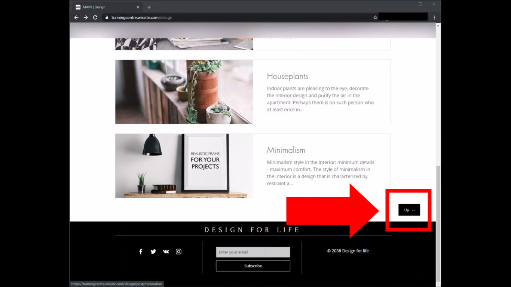

# Dezign for Life
## Issue #0933311
**Summary**: 0933311: The design page is not scrolled to the top after clicking the 'Up' button

- **Priority**: low
- **Severity**: minor
- **Reproducibility**: N/A
- **Platform**: Google Chrome 87.0.4280.88
- **OS**: Windows
- **OS Version**: 10 x64

**Description:** 'Design' page is not scrolled to the top after clicking the 'Up' button at the bottom of the page right above the footer.

**Steps To Reproduce:**
1. Open page http://trainingcentre.wixsite.com/design
2. Scroll to the bottom of the page.
3. Click on the 'Up' button on the right side above the footer.
4. Pay attention to the current position on the page.

**Actual result:** 'Design' page is not scrolled to the top after clicking the 'Up' button on the bottom of the page.

**Expected result:** 'Design' page is scrolled to the top after clicking the 'Up' button on the bottom of the page.

**Screenshot:**

