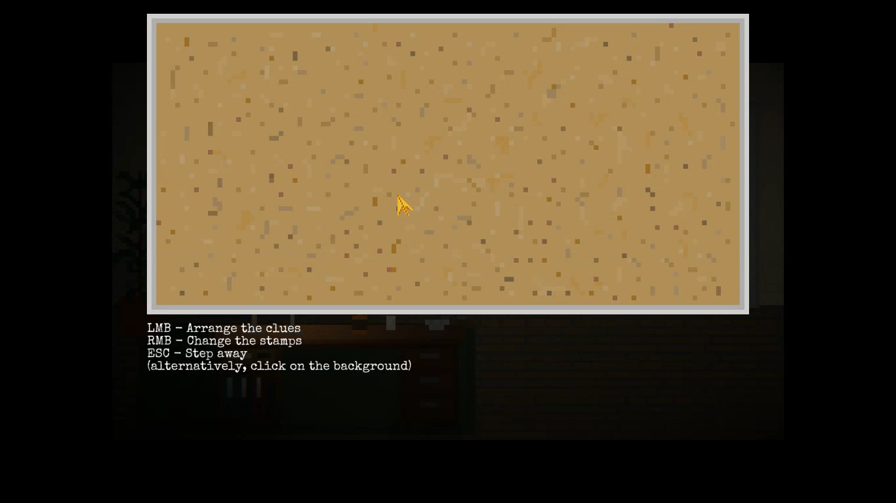

# No Questions Asked

## Issue #01

**Summary:** The incorrect color of the mouse cursor is seen on the starting location after clicking the pinboard.

**Steps to reproduce:**

1. Start a new game from the main menu.
2. Click on the pinboard.
3. Don't move the mouse cursor.
4. Pay attention to the color of the mouse cursor.

**Actual result:** The incorrect color of the mouse cursor (golden) is seen on the starting location after clicking the pinboard.

**Expected result:** The correct color of the mouse cursor (silver) is seen on the starting location after clicking the pinboard.

**Screenshot:**

**Video:**

https://user-images.githubusercontent.com/1151664/233001713-256b066f-820b-4abe-b31f-e5b4697acf50.mp4
