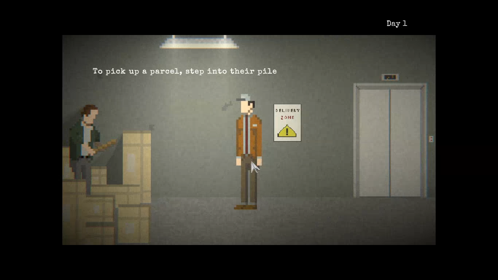

### Issue #02

**Summary:** No animation of the hero's movement is seen after holding the mouse button on him and slowly dragging away.

**Steps to reproduce:**

1. Start a new game from the main menu.
2. Click on the hero and hold the mouse button.
3. While holding the mouse button slowly move the mouse.
4. Pay attention to the hero's animation.

**Actual result:** No animation of the hero's movement is seen after holding the mouse button on him and slowly dragging away. Hero is sliding with no or almost no animation.

**Expected result:** Normal animation of the hero's movement is seen after holding the mouse button on him and slowly dragging away. Hero is not sliding.

**Screenshot:**

**Video:**

https://github.com/lukmarcus/Manual-Testing/assets/1151664/2bc66d2d-1e96-42e6-8c10-6ac664f55032
