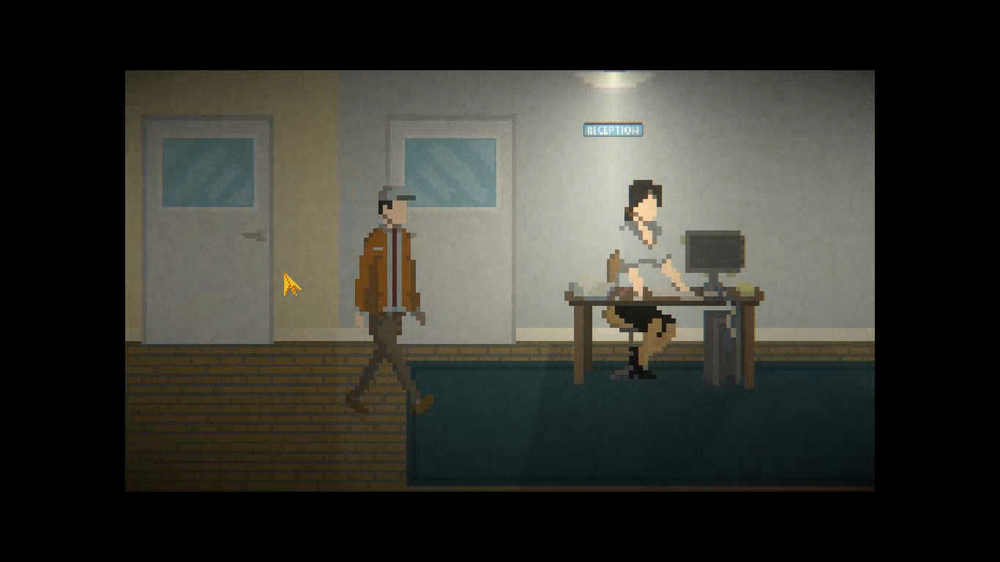

### Issue #03

**Summary:** The incorrect color of the mouse cursor is seen when moving out of the interactive objects with keyboard keys.

**Steps to reproduce:**

1. Start a new game from the main menu.
2. Move the mouse cursor over the cabinet to change its color to golden (as an interactive object).
3. Move the hero with the keyboard keys until the screen moves.
4. Pay attention to the color of the mouse cursor.

**Actual result:** The incorrect color (golden) of the mouse cursor is seen when moving out of the interactive objects with keyboard keys.

**Expected result:** The correct color (silver) of the mouse cursor is seen when moving out of the interactive objects with keyboard keys.

**Screenshot:**

**Video:**

https://github.com/lukmarcus/Manual-Testing/assets/1151664/fb1c48b3-0b02-4e0c-a0c6-a98a76765c5d
