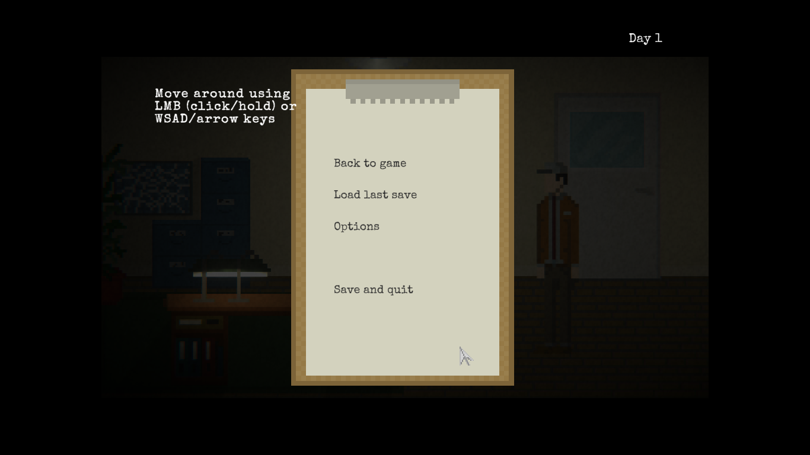
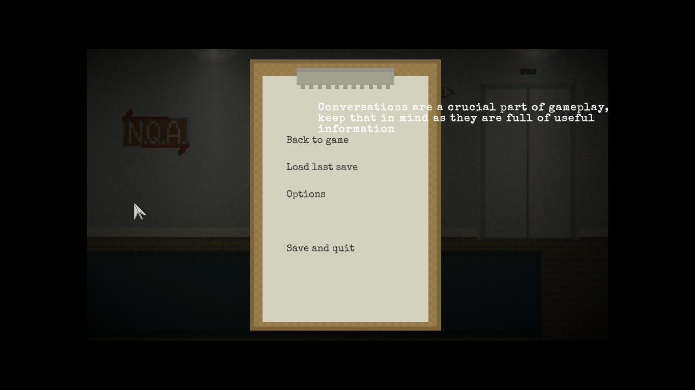

### Issue #05

**Summary:** The game information messages are seen above the in-game menu window after pressing the "ESC" key when the game information messages are present.

**Steps to reproduce:**

1. Start a new game from the main menu.
2. Move right to the screen with the elevator.
3. Press the 'ESC' key when the information message appears.
4. Pay attention to the location of the game information message.

**Actual result:** The game information messages are seen above the in-game menu window after pressing the "ESC" key when the game information messages are present.

**Expected result:** The in-game menu window is seen above all game information messages.

**Screenshots:**

