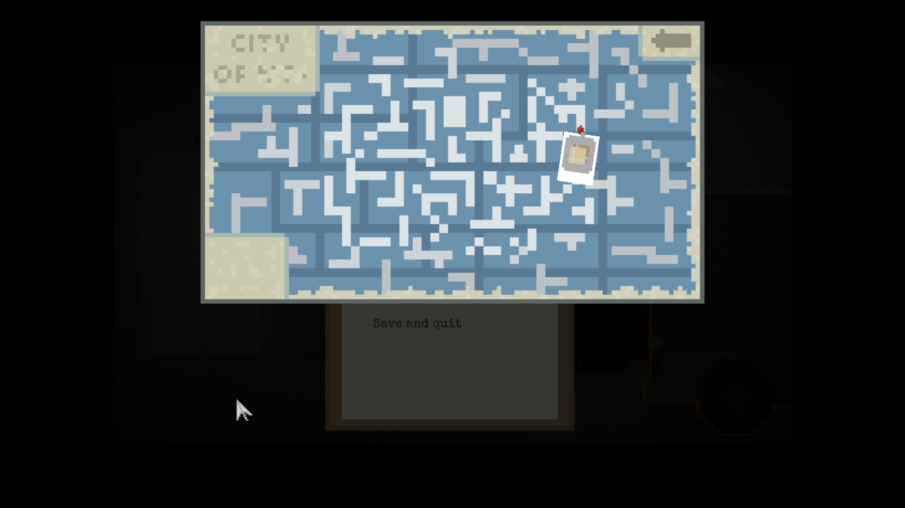

### Issue #06

**Summary:** The in-game menu window is opened below the game map after pressing the "ESC" key with the opened map.

**Steps to reproduce:**

1. Start a new game from the main menu.
2. Move to the garage, pick up the package and go to delivery.
3. Open the map with the "TAB" key.
4. Press the "ESC" key to open the in-game menu.
5. Pay attention to the location of the menu window.

**Actual result:** The in-game menu window is opened below the game map after pressing the "ESC" key with the opened map.

**Expected result:** The in-game menu window is opened above the game map after pressing the "ESC" key with the opened map OR the map is closed after pressing the "ESC" key with the opened map.

**Screenshot:**

