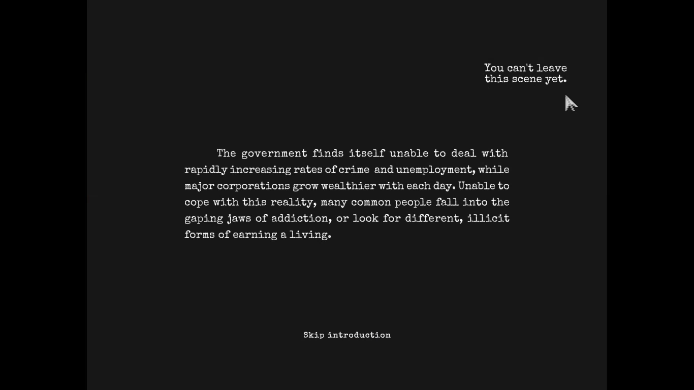

### Issue #08

**Summary:** In-game text message about the game map is seen during the intro after pressing the "TAB" key.

**Steps to reproduce:**

1. Start a new game from the main menu.
2. Press the "TAB" key during the intro.
3. Pay attention to the upper right corner of the screen.

**Actual result:** In-game text message about the game map is seen during the intro after pressing the "TAB" key.

**Expected result:** No in-game messages are seen during the intro.

**Screenshot:**

**Video:**

https://github.com/lukmarcus/Manual-Testing/assets/1151664/06163df9-a885-4195-94eb-fbfc0b6207f6
