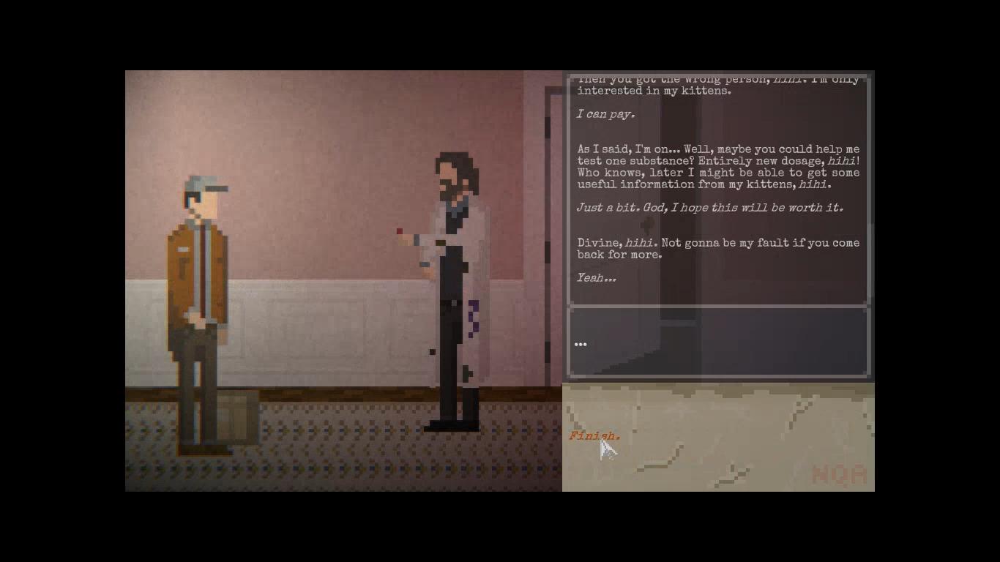

### Issue #11

**Summary:** The visual drug effect is not seen on screen on Day 2 after quickly clicking dialogue options.

**Steps to reproduce:**

1. Load 'Day 2' from the main menu.
2. Pick up the package and go to delivery.
3. Talk to the man in a white coat.
4. Quickly click dialogue options to get the drug.
5. Pay attention to the lack of visual effects.

**Actual result:** The visual drug effect is not seen on screen on Day 2 after quickly clicking dialogue options.

**Expected result:** The visual drug effect is normally seen on screen on Day 2 after quickly clicking dialogue options.

**Screenshot:**

**Video:**

https://github.com/lukmarcus/Manual-Testing/assets/1151664/12985218-d41f-4889-bb1c-6f9c43b53b04
