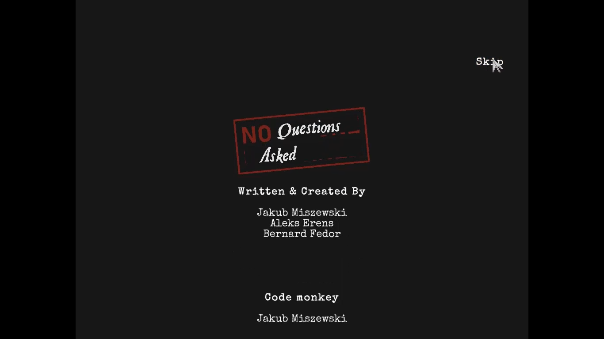

### Issue #12

**Summary:** The 'Skip' button can't be fully clicked on the 'Credits' screen.

**Steps to reproduce:**

1. Open the 'Credits' option from the main menu.
2. Move the mouse cursor over the 'Skip' button.
3. Pay attention to the clickable area of the button.

**Actual result:** The 'Skip' button can't be fully clicked on the 'Credits' screen. Only the top of the word is clickable.

**Expected result:** The 'Skip' button can be fully clicked on the 'Credits' screen.

**Screenshot:**

**Video:**

https://github.com/lukmarcus/Manual-Testing/assets/1151664/fdcf5f20-e3cd-4945-b63e-173ca9ae48dd
