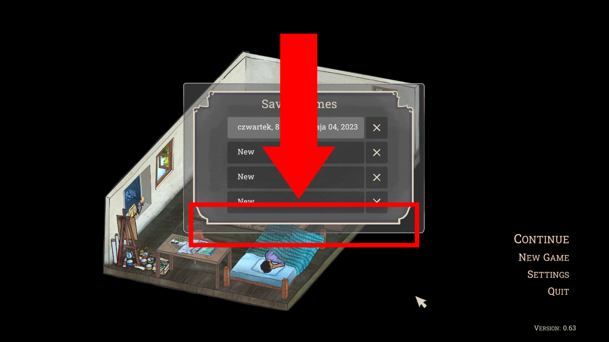

# Palace on the Hill

## Issue #23050404

**Summary:** The 'New Game' window buttons are missed on the main menu after opening the 'New Game' window with saved games.

**Game version**: 0.63 Steam

**Preconditions:**

1. At least one game is saved.

**Steps to reproduce:**

1. Open 'The Palace on the Hill Prologue' game.
2. Click on the 'New Game' option.
3. Pay attention to the missing window buttons.

**Expected result:** The 'New Game' window buttons are shown on the main menu after opening the 'New Game' window with saved games.

**Screenshot:**

