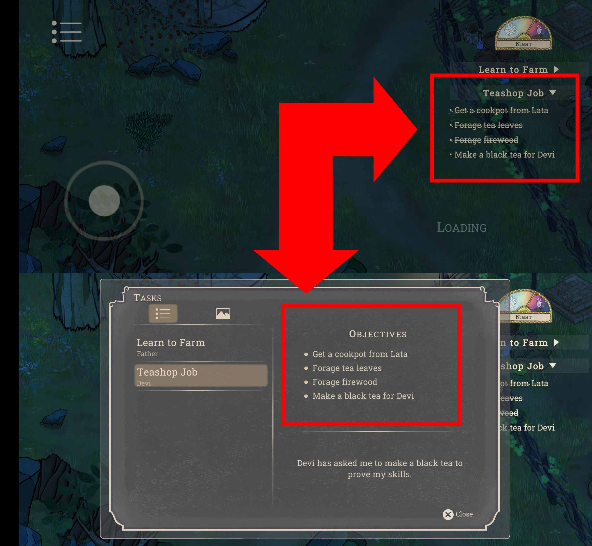

# Palace on the Hill

## Issue #23050601

**Summary:** Crossed task objectives are not synchronized with main screen objectives on the 'Tasks' screen.

**Game version**: 0.65 Android

- **OS version:** Android 11 RP1A.200720.011
- **Device:** Xiaomi Redmi 9 M2004J19AG

**Preconditions:**

1. The player started the 'Learn to Farm' quest.
2. At least one of the 'Learn to Farm' quest objectives is finished.
3. The 'Learn to Farm' quest is not finished.

**Steps to reproduce:**

1. Notice the crossed 'Learn to Farm' quest objectives on the main screen.
2. Tap on the hamburger menu.
3. Tap on the 'Tasks' button.
4. Pay attention to the list of 'Learn to Farm' quest objectives on the 'Tasks' screen.

**Expected result:** Crossed task objectives are synchronized with main screen objectives on the 'Tasks' screen.

**Screenshot:**

