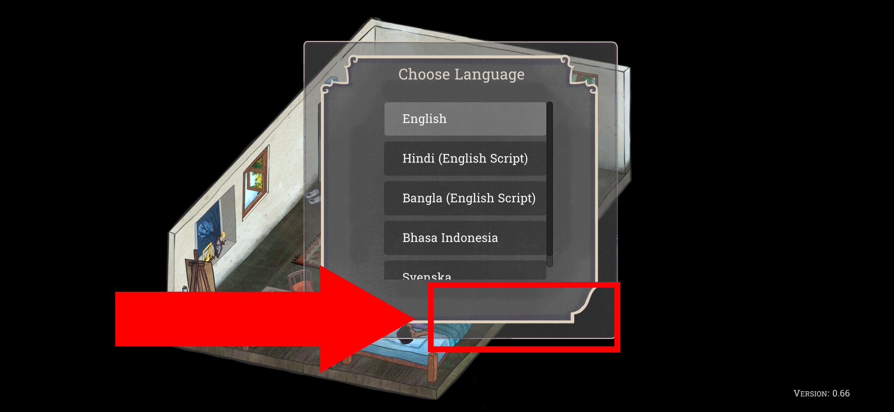

# Palace on the Hill

## Issue #23050902

**Summary:** The 'Close' button is missed on the 'New Game' window after tapping on the 'New Game' option in the main menu.

**Game version**: 0.66 Android

- **OS version:** Android 11 RP1A.200720.011
- **Device:** Xiaomi Redmi 9 M2004J19AG

**Steps to reproduce:**

1. Open 'The Palace on the Hill Prologue' game.
2. Tap on the 'New Game' option.
3. Pay attention to the no closing button on the 'New Game' window.

**Expected result:** The 'Close' button is shown on the 'New Game' window after tapping on the 'New Game' option in the main menu.

**Screenshot:**

