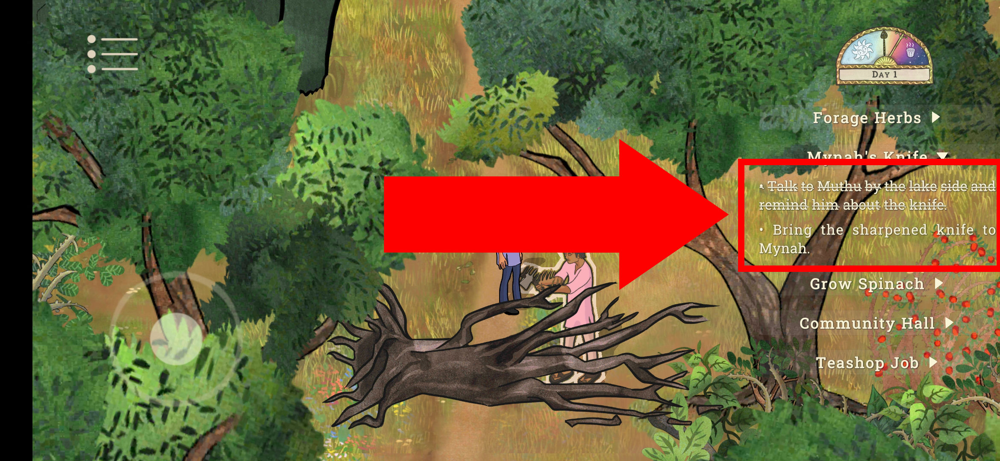

# Palace on the Hill

## Issue #23050904

**Summary:** An inaccurate 'Bring the sharpened knife to Mynah' objective is shown in the 'Mynah's Knife' task after talking to the 'Muthu' person about the knife.

**Game version**: 0.66 Android

- **OS version:** Android 11 RP1A.200720.011
- **Device:** Xiaomi Redmi 9 M2004J19AG

**Preconditions:**

1. The player started the 'Mynah's Knife' quest.

**Steps to reproduce:**

1. Take the road down from the fields.
2. Talk to the 'Muthu' person.
3. Choose the 'Knife' option.
4. Pay attention to the 'Mynah's Knife' task objectives.

**Expected result:** The new objective about getting the knife from the blacksmith person is added to the 'Mynah's Knife' task after talking to the 'Muthu' person about the knife.

**Screenshot:**

