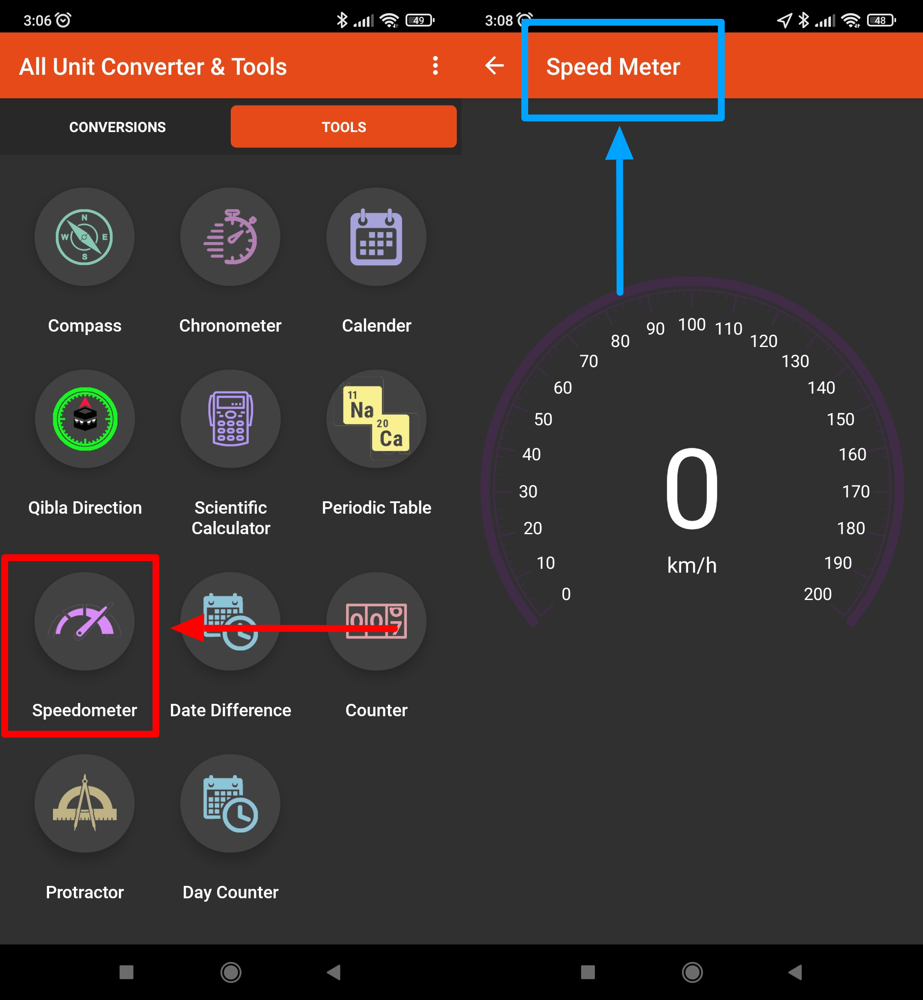

# All Unit Converter & Tools

## Issue #0937971

**Summary**: 0937971: [Mobile] Android: An invalid name for the 'Speedometer' option is shown on the screen after tapping the icon in the 'Tools' tab

- **Priority**: normal
- **Severity**: text
- **Reproducibility**: always
- **Platform**: Mobile
- **OS**: Android
- **OS Version**: 11

**Description:** An invalid name ('Speed Meter') for the 'Speedometer' option is shown on the 'Speedometer' screen after tapping the 'Speedometer' icon in the 'Tools' tab.

**Steps To Reproduce:**

1. Open 'All Unit Converter & Tools' app.
2. Tap the 'Tools' tab.
3. Locate the 'Speedometer' icon.
4. Note the 'Speedometer' name.
5. Tap the 'Speedometer' icon.
6. Pay attention to the function name at the top of the screen.

**Actual result:** An invalid name ('Speed Meter') for the 'Speedometer' option is shown on the 'Speedometer' screen after tapping the 'Speedometer' icon in the 'Tools' tab.

**Expected result:** A valid name ('Speedometer') for the 'Speedometer' option is shown on the 'Speedometer' screen after tapping the 'Speedometer' icon in the 'Tools' tab.

**Screenshot:**

**Additional Information:**

- Device: Xiaomi Redmi 9 M2004J19AG, Android 11 RP1A.200720.011
- Application: All Unit Converter & Tools
