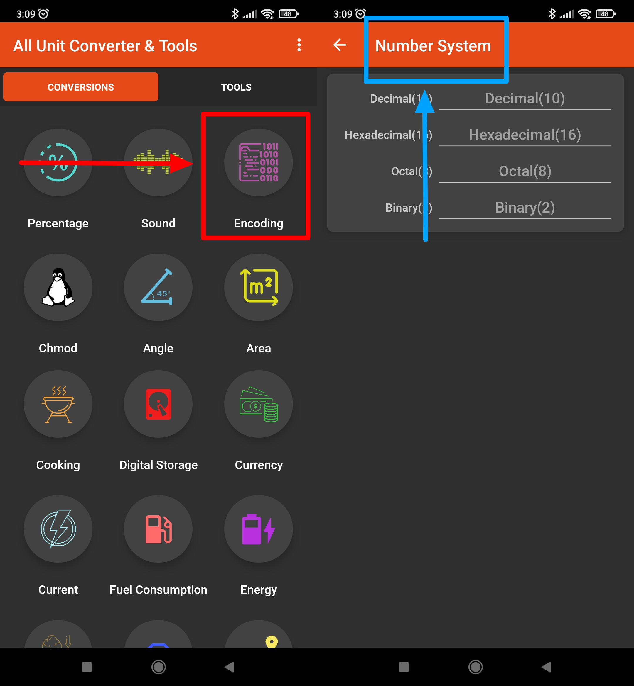

# All Unit Converter & Tools

## Issue #0937974

**Summary**: 0937974: [Mobile] Android: Invalid name for the 'Encoding' option is shown on the screen after tapping the icon in the 'Conversions' tab

- **Priority**: normal
- **Severity**: tweak
- **Reproducibility**: always
- **Platform**: Mobile
- **OS**: Android
- **OS Version**: 11

**Description:** An invalid name ('Number System') for the 'Encoding' option is shown on the 'Encoding' screen after tapping the 'Encoding' icon in the 'Conversions' tab.

**Steps To Reproduce:**

1. Open 'All Unit Converter & Tools' app.
2. Locate the 'Encoding' icon.
3. Note the 'Encoding' name.
4. Tap the 'Encoding' icon.
5. Pay attention to the function name at the top of the screen.

**Actual result:** An invalid name ('Number System') for the 'Encoding' option is shown on the 'Encoding' screen after tapping the 'Encoding' icon in the 'Conversions' tab.

**Expected result:** A valid name ('Encoding') for the 'Encoding' option is shown on the 'Encoding' screen after tapping the 'Encoding' icon in the 'Conversions' tab.

**Screenshot:**

**Additional Information:**

- Device: Xiaomi Redmi 9 M2004J19AG, Android 11 RP1A.200720.011
- Application: All Unit Converter & Tools
