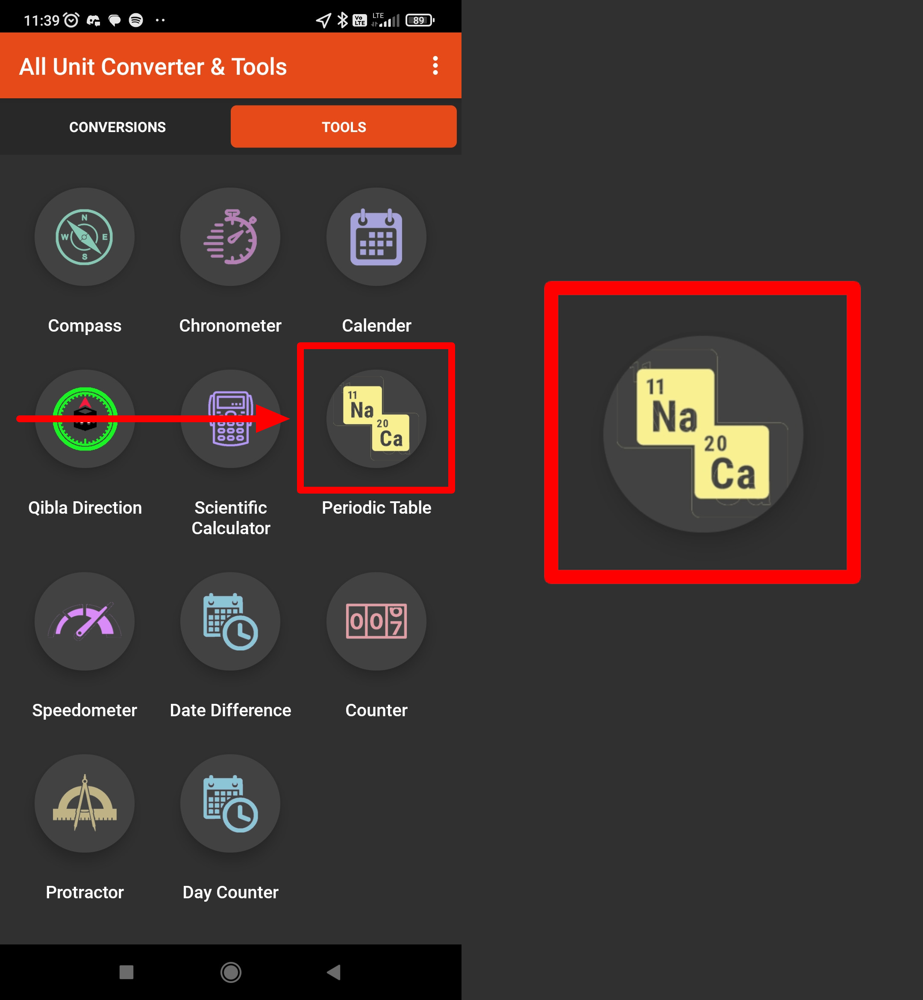

# All Unit Converter & Tools

## Issue #0937985

**Summary**: 0937985: [Mobile] Android: The second (bigger) contour of the 'Periodic Table' icon is seen under the icon in the 'Tools' tab

- **Priority**: low
- **Severity**: tweak
- **Reproducibility**: always
- **Platform**: Mobile
- **OS**: Android
- **OS Version**: 11

**Description:** The second (bigger) contour of the 'Periodic Table' icon is seen under the 'Periodic Table' icon in the 'Tools' tab.

**Steps To Reproduce:**

1. Open 'All Unit Converter & Tools' app.
2. Tap the 'Tools' tab.
3. Locate the 'Periodic Table' icon.
4. Pay attention to the background of the 'Periodic Table' icon.

**Actual result:** The second (bigger) contour of the 'Periodic Table' icon is seen under the 'Periodic Table' icon in the 'Tools' tab.

**Expected result:** No second contour of the 'Periodic Table' icon is seen under the 'Periodic Table' icon in the 'Tools' tab.

**Screenshot:**

**Additional Information:**

- Device: Xiaomi Redmi 9 M2004J19AG, Android 11 RP1A.200720.011
- Application: All Unit Converter & Tools
