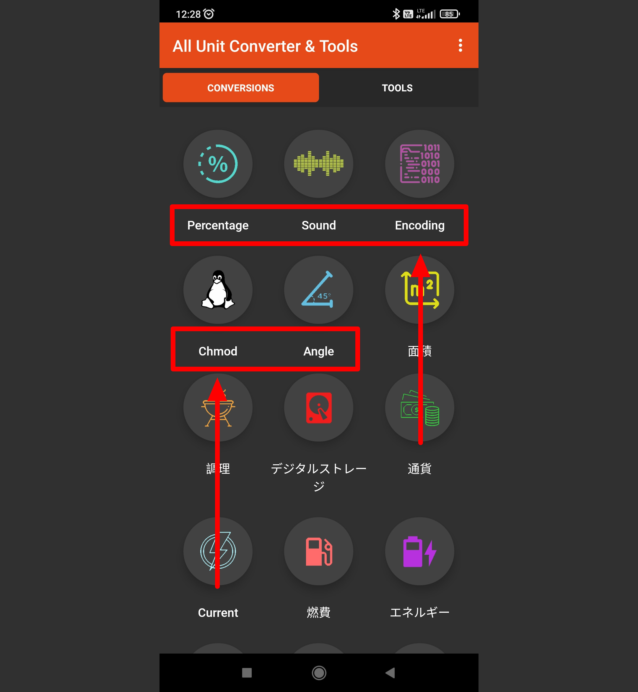

# All Unit Converter & Tools

## Issue #0938096

**Summary**: 0938096: [Mobile] Android: English names of the functions are shown in the 'Conversions' tab after changing the language

- **Priority**: high
- **Severity**: minor
- **Reproducibility**: always
- **Platform**: Mobile
- **OS**: Android
- **OS Version**: 11

**Description:** English names of the functions are shown in the 'Conversions' tab after changing the language.

**Steps To Reproduce:**

1. Open 'All Unit Converter & Tools' app.
2. Tap the three-dot menu.
3. Tap the 'Settings' option.
4. Tap the 'Language' option.
5. Switch to a different language option.
6. Tap the left arrow on the upper left side of the 'Settings' screen.
7. Pay attention to the names of functions.

**Actual result:** English names of the functions are shown in the 'Conversions' tab after changing the language.

**Expected result:** Selected language names of the functions are shown in the 'Conversions' tab after changing the language.

**Screenshot:**

**Additional Information:**

- Device: Xiaomi Redmi 9 M2004J19AG, Android 11 RP1A.200720.011
- Application: All Unit Converter & Tools
